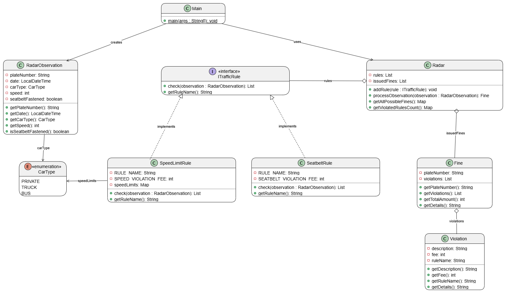
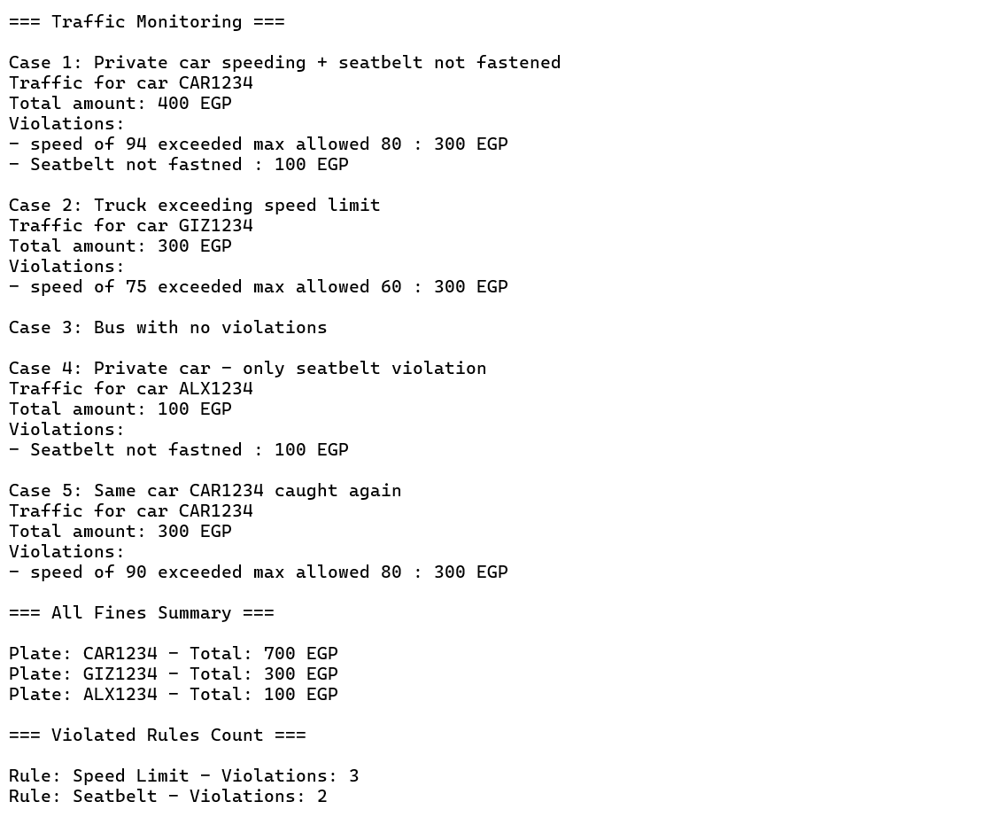

# Radar System Analysis and Design

## Design Pattern

The system applies the **Strategy Pattern**:

- **`ITrafficRule`** (Interface) The Strategy defines the contract for any traffic rule.
- **`SpeedLimitRule`** checks speed limits per car type.
- **`SeatbeltRule`** checks seatbelt compliance.
- **`Radar`** The Context uses the rules without knowing their internal details.

**Why?** New rules can be added by implementing `ITrafficRule` and calling `radar.addRule()` without modifying the `Radar` class. This follows the **Open/Closed Principle**.

## Data Structures

### ArrayList
- `rules` in `Radar` stores the registered traffic rules.
- `issuedFines` in `Radar` stores all fines issued by the radar.

Used because we only need to add elements and iterate over them. ArrayList gives O(1) add and fast iteration.

### HashMap
- `speedLimits` in `SpeedLimitRule` maps each CarType to its maximum allowed speed.

Used because we need fast O(1) lookup to get the speed limit for a given car type. Order doesn't matter here.

### LinkedHashMap
- Return value of `getAllPossibleFines()` maps plate number to total fine amount.
- Return value of `getViolatedRulesCount()` maps rule name to how many times it was violated.

Used instead of regular HashMap because we need to preserve insertion order when printing results.

## UML Class Diagram

## Program Output

